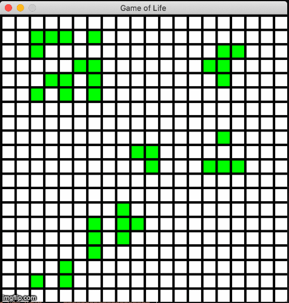

# Game Of Life

This game is a simple command-line Python3 implementation of Conway's Game of Life using the Pygame library. 
It was created using MacOS Catalina Version 10.15.1 and Visual Studio Code. 

## Principle 

Conway's Game of Life consists in simulating the evolution of a population of individuals represented in a 2-Dimensional grid. 
At the beginning, the grid can be arbitrarly filled with alive individuals (one per cell), who will reproduce, die or survive according to the following rules : 

1. Any live cell with fewer than two live neighbours dies, as if by underpopulation.
2. Any live cell with two or three live neighbours lives on to the next generation.
3. Any live cell with more than three live neighbours dies, as if by overpopulation.
4. Any dead cell with exactly three live neighbours becomes a live cell, as if by reproduction

For more details, see : https://en.wikipedia.org/wiki/Conway%27s_Game_of_Life

## Prerequisites 

If not already done : 

Follow this guide to download the latest version of Python3 : https://realpython.com/installing-python/

Install the `numpy` library with `pip` : 

`pip install numpy` 

`pip install pygame`

## Instructions 

All the files have to be kept in the same folder. 

Execute the following command to begin a new game : 

`python3 playGame.py`

